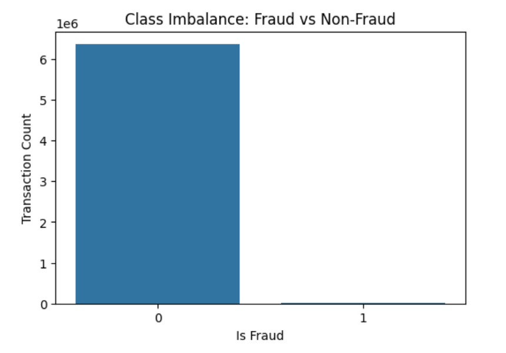
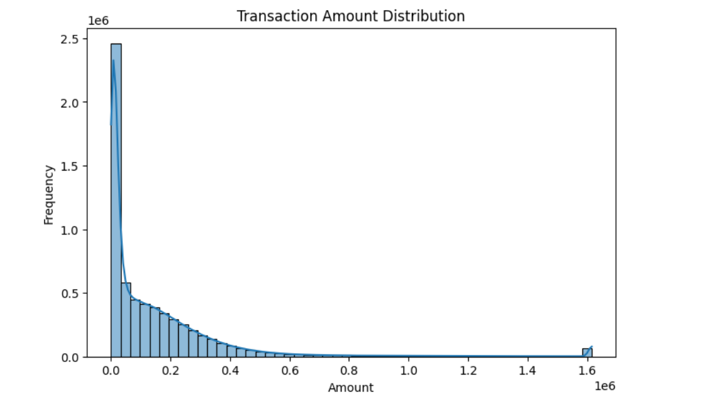
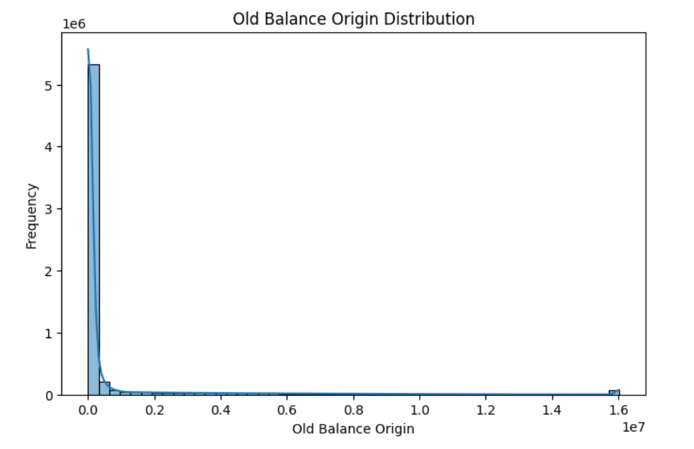
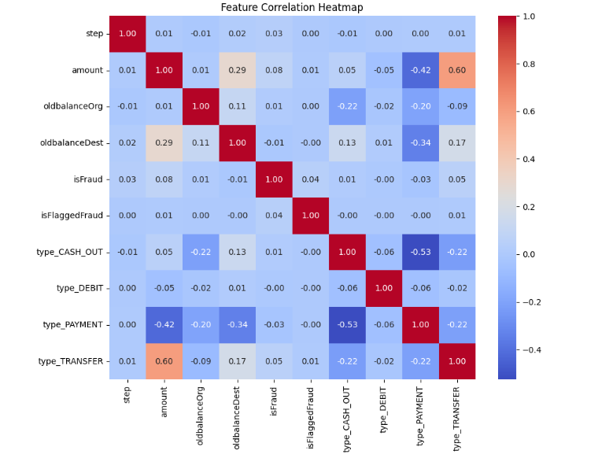
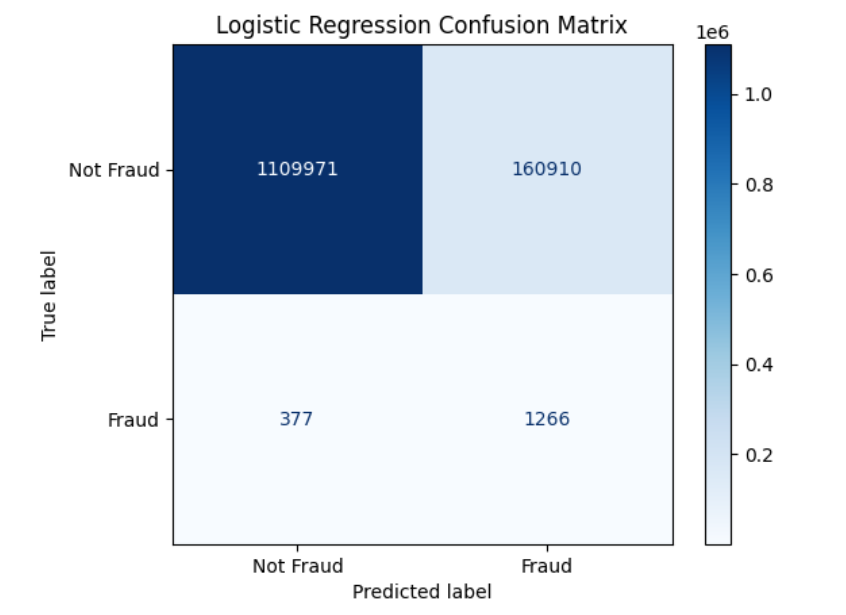
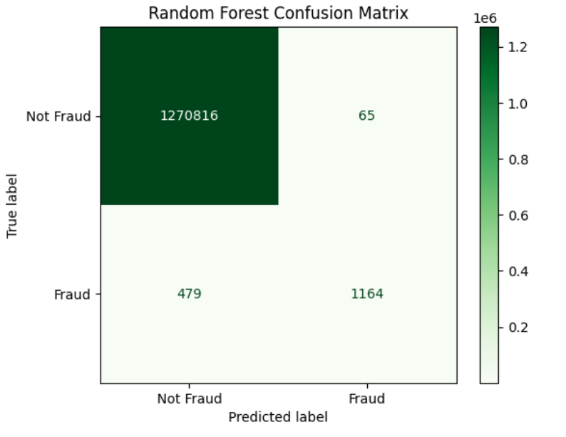
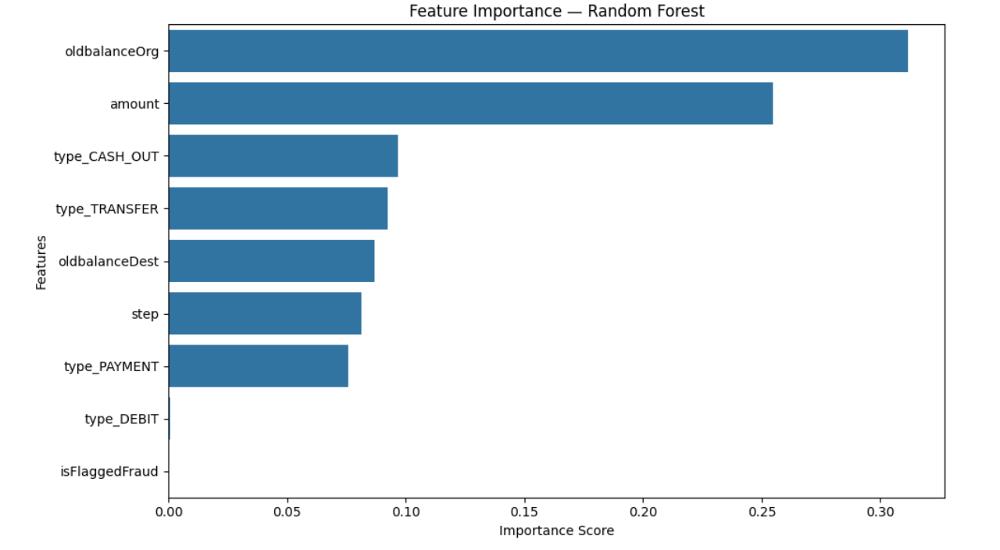
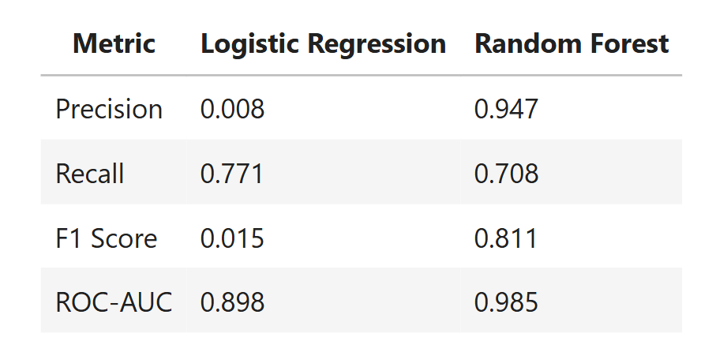

# Fraud Detection in Financial Transactions

## 🚀 Project Overview

This project focuses on building a **Fraud Detection Machine Learning System** for a financial company. The goal is to detect fraudulent transactions proactively and provide insights for prevention strategies.

Key highlights:
- Binary classification problem (Fraud vs Non-Fraud)  
- Dataset: 6,362,620 transactions with 10+ features  
- Extreme class imbalance: only 0.13% of transactions are fraudulent  
- Evaluation metrics: Precision, Recall, F1-Score, ROC-AUC, PR-AUC  

<br>

## 📊 Dataset Description

- **step**: Unit of time (1 step = 1 hour, total 744 steps = 30 days)  
- **type**: Transaction type (`CASH-IN`, `CASH-OUT`, `DEBIT`, `PAYMENT`, `TRANSFER`)  
- **amount**: Transaction amount in local currency  
- **nameOrig / nameDest**: Sender and receiver IDs  
- **oldbalanceOrg / newbalanceOrig**: Sender’s balance before and after transaction  
- **oldbalanceDest / newbalanceDest**: Receiver’s balance before and after transaction  
- **isFraud**: Fraudulent transaction indicator (1 = fraud)  
- **isFlaggedFraud**: Flagged illegal transactions (>200,000 in single transfer)  

<br>

## 🔎 Exploratory Data Analysis (EDA)

### Class Imbalance
  

The dataset is highly imbalanced with **0.13% fraudulent transactions**, which necessitates special handling during modeling.

### Transaction Type Distribution
  

CASH_OUT and TRANSFER transactions are more likely to involve fraud.

### Amount Distribution
  

Most transactions are low-value, but fraudulent transactions tend to occur in higher amounts.

### Sender Balance Distribution
  

Fraud tends to occur more often in accounts with **higher balances**.

### Feature Correlation
  

Highly correlated features (`oldbalanceOrg` vs `newbalanceOrig`, `oldbalanceDest` vs `newbalanceDest`) were handled to avoid multicollinearity.

<br>

## 🏗️ Model Building

We trained **two models**:

1. **Logistic Regression** (baseline)  
2. **Random Forest** (final model)  

Class imbalance was handled using **class weights**.

<br>

## 📈 Model Evaluation

### Logistic Regression Confusion Matrix
  

- Precision: 0.0078  
- Recall: 0.7705  
- F1-Score: 0.0155  
- ROC-AUC: 0.8979  

### Random Forest Confusion Matrix
  

- Precision: 0.9471  
- Recall: 0.7085  
- F1-Score: 0.8106  
- ROC-AUC: 0.9853  

<br>

## 🔑 Feature Importance

  

Top predictors of fraud:

1. `oldbalanceOrg`  
2. `amount`  
3. `type_CASH_OUT`  
4. `type_TRANSFER`  

<br>

## 📊 Model Comparison

  


<br>

## 🛡️ Fraud Prevention Insights

Based on model analysis:

1. Monitor **high-value CASH_OUT and TRANSFER transactions**.  
2. Flag accounts with **large sender balances** performing suspicious transfers.  
3. Implement **real-time transaction monitoring**.  
4. Set **thresholds using model scores** to minimize false negatives.  
5. Multi-layer fraud detection: combine **rules + ML model predictions**.  
6. Track unusual patterns in **new accounts or inactive accounts**.  
7. Continuously monitor **model performance and drift** post-deployment.

<br>

## ⚡ Key Takeaways

- Random Forest performed significantly better than Logistic Regression on **imbalanced data**.  
- Model interpretability highlights **account balance and transaction type** as key predictors.  
- Proper EDA and visualization are crucial for explaining fraud patterns to business stakeholders.  
- This notebook demonstrates **end-to-end ML workflow**: from data cleaning → EDA → modeling → evaluation → business insights.
<br>

## 🛠️ Getting Started / Requirements

To run this project locally, you need Python installed (recommended >= 3.9) and the required libraries listed in `requirements.txt`.

### 1. Clone the repository
```bash
  git clone https://github.com/<your-username>/Fraud-Detection-ML.git
  cd Fraud-Detection-ML
```
### 2. Install required packages
```bash
  pip install -r requirements.txt
```
### 3. Launch Jupyter Notebook
```bash
  jupyter notebook Fraud_Detection_Transaction_Analysis.ipynb
```

